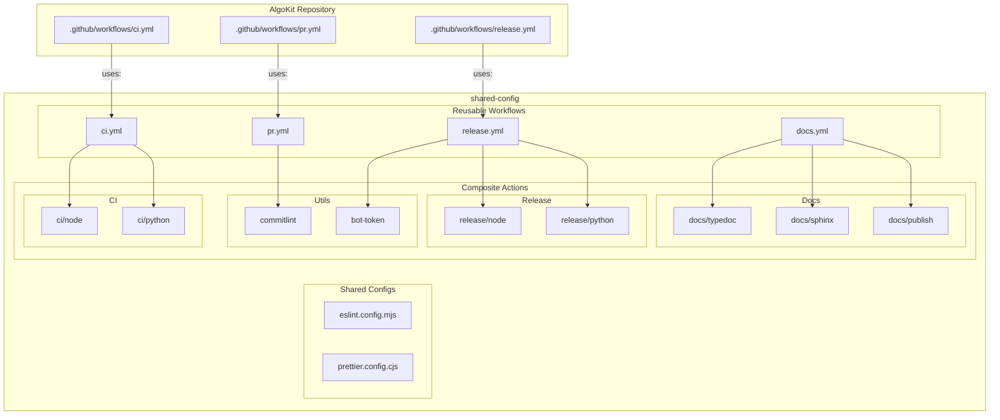

# Architecture Overview

<!--
There are three distinct layers here. Workflows are the entry points that consuming repos call, actions are implementation details, and configs are npm packages. This separation of concerns makes maintenance tractable. You can change an action's internals without touching workflow signatures. Before we dive into each layer, let's discuss how to reference these, because branching strategy matters.
-->
