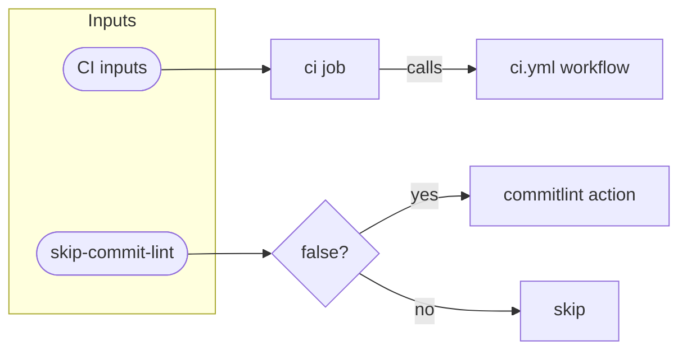

# PR Workflow Flow

::caption::
CI inputs pass through to ci.yml; `ci` and `commit-lint` jobs run in parallel

<!--
CI and commit-lint run in parallel so developers get both results quickly; neither blocks the other. Note that fetch-depth: 0 is required for commitlint to see the full commit range. Now let's look at semantic versioning and how we handle beta versus stable releases.
-->
