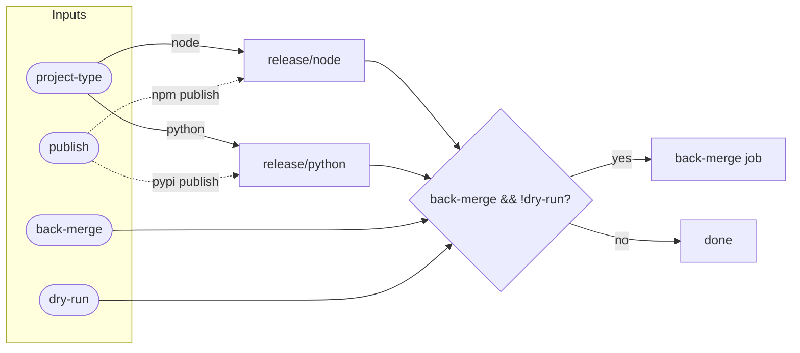

# Release Workflow Flow

::caption::
`publish` enables atomic registry publishing; `back-merge` only runs on real releases

<!--
The publish flag enables atomic registry publishing and OIDC controls authentication. Back-merge only runs on real releases, not dry-runs. The dry-run option lets you preview what would happen without side effects, which is useful for testing release configuration changes. Here's what the actual consumer workflow looks like; notice how simple it is.
-->
