# Orchestration Flow: Beta & Stable

```mermaid {scale: 0.5}
flowchart TB
  subgraph main_branch[Main Branch]
    pr([PR Merged]) --> ci[CI]
    ci -->|success| docs[Docs]
    docs -->|success| beta[Release Beta]
    beta --> published_beta[1.2.0-beta.1]
  end

  subgraph release_branch[Release Branch]
    promote([Merge main → release]) --> stable[Release Stable]
    manual([Manual Dispatch]) --> stable
    stable --> published_stable[1.2.0]
    published_stable --> backmerge[Back-merge to main]
  end

  main_branch -.->|promote| release_branch
  backmerge -.->|sync| main_branch
```

::caption::
Main produces betas; release branch accepts merge or manual dispatch for stable releases

<!--
Two branches, two workflows, one strategy. Main runs the full pipeline on every merge. For stable releases, you can either merge main to release or manually trigger from GitHub UI, which is useful for re-running failed releases. The release workflow skips CI and docs, creates a stable version, and back-merges automatically. Semantic-release determines beta vs stable based on branch name.
-->
