# Why DevPortal Matters

::left::

### For Developers

- **Central hub** for all SDK documentation
- Consistent navigation across projects
- Version-aware docs (latest + tagged releases)
- Search across entire ecosystem

### For Kapa AI

- Kapa **consumes DevPortal** to answer questions
- Stale docs → stale AI responses
- Up-to-date docs → accurate answers
- Every merge refreshes the knowledge base

::right::

```mermaid {scale: 0.65}
flowchart TB
  merge([Merge to main]) --> docs[Docs Workflow]
  docs --> pages[GitHub Pages]
  docs --> devportal[DevPortal Branch]
  devportal --> hub[DevPortal Hub]
  hub --> devs[👨‍💻 Developers]
  hub --> kapa[🤖 Kapa AI]
  kapa --> answers[Accurate Responses]
```

**Result:** One workflow keeps humans and AI in sync

<!--
DevPortal serves two audiences: human developers browsing documentation and Kapa AI answering questions. When someone asks Kapa about algokit-utils, it searches DevPortal for current docs. If we only published on releases, docs would be weeks or months stale. By publishing on every merge, both audiences get current information. This is why we default to always-publish. The cost of stale AI responses is too high.
-->
