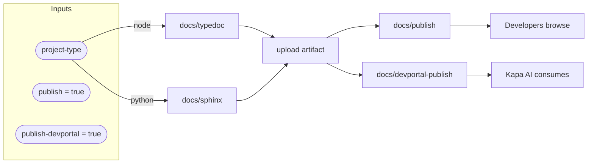

# Docs Workflow Flow

::caption::
Both targets publish by default; DevPortal feeds Kapa AI for intelligent documentation answers

<!--
Both GitHub Pages and DevPortal publish by default. Docs are built once and deployed to both targets. DevPortal is particularly important because Kapa AI consumes it to power intelligent documentation responses. When developers ask Kapa a question, it searches the latest DevPortal docs. Stale documentation means stale answers. By defaulting to always-publish, we ensure both human developers and AI assistants have current reference material without any per-repo configuration.
-->
