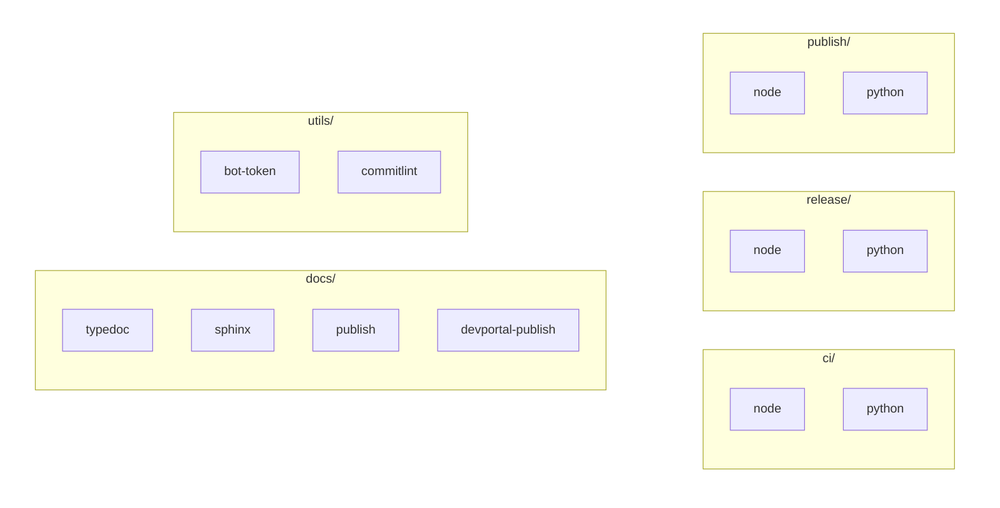

# Actions Overview

::left::

### Purpose

Composable building blocks used by workflows.

### Groups

- `ci/`: node, python
- `release/`: node, python
- `publish/`: node, python
- `docs/`: typedoc, sphinx, publish, devportal-publish
- `utils/`: bot-token, commitlint

### Notes

Each action is single-purpose and reusable.

::right::

<!--
Each action follows single-responsibility: one action does one thing well. There are five groups: ci/, release/, publish/, docs/, and utils/. Single-purpose actions are easier to test, maintain, and reuse, and you can mix and match them to build custom pipelines. Let's compare the Node and Python CI actions to see how they handle ecosystem differences.
-->
