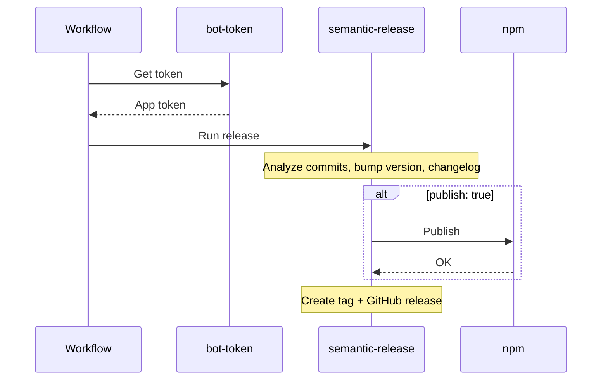

# Release Actions

::left::

### Purpose

Automate versioning, tagging, and publishing.

### Key pieces

- `utils/bot-token`
- `release/node` or `release/python`
- registry publish step

### Notes

Atomic publish ensures tags only after successful publish.

::right::

<!--
The release sequence is: get bot token, run semantic-release, publish to registry if enabled, then create tag. Publish happens before tag for atomicity. If publish fails, you don't get a dangling Git tag pointing to a version that doesn't exist in the registry. Now let's look at the utility actions that support these workflows.
-->
