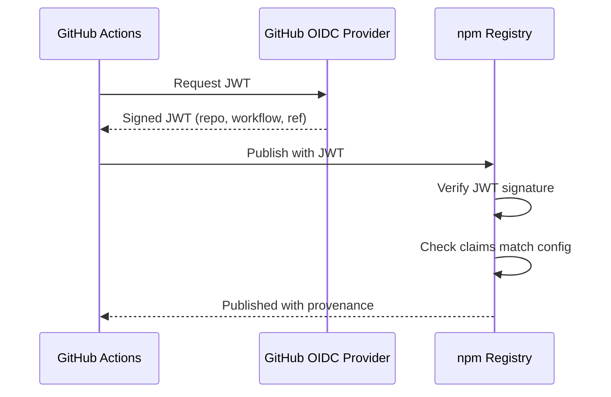

# OIDC Flow

::left::

### Purpose

Show how OIDC proves workflow identity to registries.

### Steps

1. Actions requests JWT
2. OIDC provider signs JWT
3. Registry verifies and publishes

### Notes

No long-lived secrets in GitHub.

::right::

<!--
The JWT contains claims about repo, workflow, and ref. The registry verifies the signature and checks that claims match configured policies. No secrets are stored anywhere. The identity proof is generated fresh for each workflow run and verified cryptographically. The key insight is that npm and PyPI trust GitHub's OIDC provider, which vouches for your workflow's identity. During this same flow, Sigstore uses the OIDC identity to sign a provenance attestation, linking the published package to its source commit and build workflow. This happens automatically with trusted publishing.
-->
